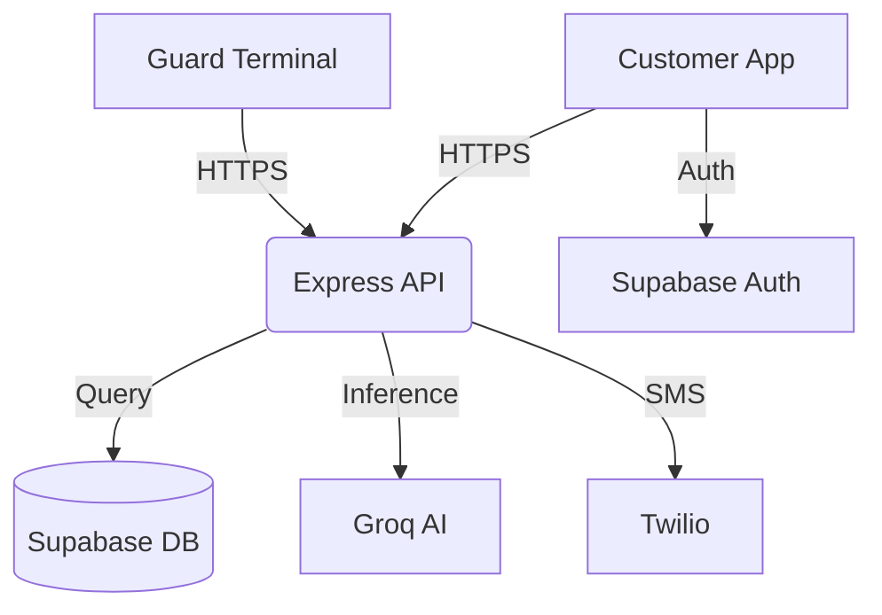

# ScanGo: Comprehensive Project Documentation

ScanGo is an end-to-end retail automation ecosystem designed to bridge the gap between physical shopping and digital convenience. This document provides a deep dive into the system's architecture, workflows, and technical implementation.

---

## 🔄 System Workflow

The ScanGo experience is divided into three primary phases: **Onboarding**, **Shopping**, and **Verification**.

### 1. Onboarding & Store Sync
- **Authentication**: Users log in via the `Login.tsx` component. Customers use their phone numbers, while employees use secure credentials.
- **Context Selection**: Upon login, customers must select a specific store location. This ensures the app fetches the correct inventory, pricing, and tax rules relevant to that physical site.

### 2. The Shopping Journey
- **Discovery & Scanning**: Using the `Scan.tsx` module, customers use their device camera to scan product barcodes. The system performs a real-time lookup against the Supabase database.
- **Cart Dynamics**: Items are added to a virtual cart where the system calculates:
  - **Subtotal**: Current selling price sum.
  - **Total Savings**: Difference between MRP and selling price.
- **AI Assistance**: Throughout the journey, a Groq-powered AI assistant is available via the `ChatInterface.tsx` to answer questions about product locations, store policies, or technical help.

### 3. Checkout & Secure Exit
- **Payment Processing**: Users finalize their purchase in `Checkout.tsx`, choosing between various payment methods (Digital Wallets, Cards, etc.).
- **Order Finalization**: An immutable order record is created, and a unique QR code is generated for the transaction (`QR.tsx`).
- **Guard Verification**: At the store exit, a security guard uses the **ScanGo Guard Terminal**. They scan the customer's QR code, which instantly pulls up the digital receipt. The guard verifies the physical items against the digital list to ensure security.

---

## ✨ Core Features & Explanations

### 📱 Customer Features
- **Smart Scanner**: Uses high-performance camera hooks to handle barcode detection with low latency and high accuracy even in varying lighting conditions.
- **Manual Barcode Entry**: A fallback mechanism for damaged labels, allowing users to type in GTIN/EAN codes manually.
- **Real-time Cart Management**: Features like "Quantity Adjust" and "Quick Remove" allow users to maintain full control over their budget before reaching the checkout.
- **Transaction History**: A dedicated `History.tsx` page provides a look-back at all previous orders, including digital receipts for returns or warranty claims.

### 👮 Employee Features
- **Multi-Role Terminal**: A single application (`scango-guard`) that adapts its UI based on whether the logged-in user is a **Cashier** (assisting with checkout) or a **Guard** (verifying exits).
- **Validation Engine**: The verification logic compares the scanned QR payload against the live database state to prevent the reuse of old receipts or fraudulent codes.

---

## 🛠️ Technology Stack

### Frontend Architecture
- **React (v18/19)**: Chosen for its robust component-based architecture and efficient rendering.
- **Vite**: Serves as the build tool, providing near-instant Hot Module Replacement (HMR) during development.
- **Tailwind CSS**: Used for the "Mobile-First" responsive design, ensuring a consistent experience across various smartphone models.

### Backend & Services
- **Node.js & Express**: Provides a lightweight but scalable API layer to handle business logic that shouldn't live on the client.
- **Supabase**: 
  - **PostgreSQL**: Stores relational data like products, users, and orders.
  - **Auth**: Manages secure user sessions.
- **Groq SDK**: Powers the LPU-accelerated AI chat, providing human-like responses to store-related queries.
- **Ethers.js**: Integrated for cryptographic signing and potential future blockchain-based loyalty or payment verification.
- **Twilio**: Used for transactional SMS notifications and two-factor authentication.

---

## 🏗️ Technical Architecture

### Key Modules
- **`services/apiService.ts`**: The central communication hub for all backend requests.
- **`services/product.service.ts`**: Handles the abstraction of barcode lookups and inventory checks.
- **`components/SystemArchitecture.tsx`**: A built-in visualization tool that explains the system to developers and administrators directly within the app.
