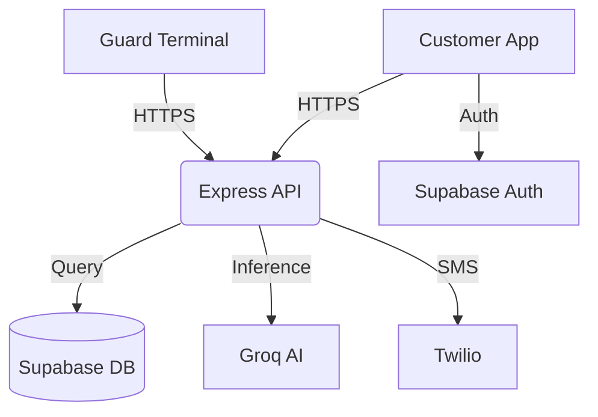

# 🛒 ScanGo: Smart Retail Automation Ecosystem

**ScanGo** is an end-to-end retail automation platform designed to bridge the gap between physical shopping and digital convenience. It streamlines the entire retail journey—from product discovery and scanning to secure checkout and verification.

---

## 📑 Table of Contents
- [🔄 System Workflow](#-system-workflow)
- [✨ Core Features](#-core-features)
- [🛠️ Technology Stack](#️-technology-stack)
- [🏗️ Technical Architecture](#️-technical-architecture)
- [📦 Project Structure](#-project-structure)
- [🚦 Getting Started](#-getting-started)
- [📝 Environment Variables](#-environment-variables)
- [📄 License](#-license)

---

## 🔄 System Workflow

The ScanGo experience is divided into three primary phases:

1.  **Onboarding & Store Sync**: Secure authentication for customers (phone) and employees. Location-based context selection ensures accurate inventory and pricing.
2.  **The Shopping Journey**: 
    - **Smart Scanning**: Customers scan barcodes via `Scan.tsx`.
    - **AI Assistance**: Groq-powered chat (`ChatInterface.tsx`) provides real-time support.
    - **Cart Management**: Real-time calculation of totals and savings.
3.  **Checkout & Secure Exit**: 
    - **Payment**: Finalize purchase in `Checkout.tsx`.
    - **Verification**: A unique QR code is generated for exit verification at the **ScanGo Guard Terminal**.

---

## ✨ Core Features

### 📱 Customer Application
- **Smart Scanner**: High-performance barcode detection with fallback manual entry.
- **Real-time Cart**: Instant subtotal and savings calculation.
- **AI Chat Assistant**: Groq-powered assistant for store-related queries.
- **Transaction History**: Comprehensive view of past digital receipts.

### 👮 Employee Terminal (`scango-guard`)
- **Dual Mode**: Adapts UI for **Cashiers** (checkout assistance) and **Guards** (exit verification).
- **Validation Engine**: Real-time verification of QR payloads against database state.
- **Secure Exit**: Prevents shrinkage via digital-to-physical item verification.

---

## 🛠️ Technology Stack

| Layer | Technology |
| :--- | :--- |
| **Frontend** | [React](https://react.dev/) (v18/19), [Vite](https://vitejs.dev/), [Tailwind CSS](https://tailwindcss.com/) |
| **Backend** | [Node.js](https://nodejs.org/), [Express](https://expressjs.com/) |
| **Database** | [Supabase](https://supabase.com/) (PostgreSQL + Auth) |
| **AI/ML** | [Groq SDK](https://groq.com/) (LPU-accelerated Inference) |
| **Integrations** | [Twilio](https://www.twilio.com/), [Ethers.js](https://docs.ethers.org/), [Lucide React](https://lucide.dev/) |

---

## 🏗️ Technical Architecture



---

## 📦 Project Structure

-   [./](./): Root directory containing the **Main Customer Application**.
-   [./scango-guard/](./scango-guard/): Specialized **Employee Terminal** for guards and cashiers.
-   [./server/](./server/): **Shared Backend API** handling business logic, AI inference, and integrations.
-   [./services/](./services/): Shared frontend service layers (API, Supabase, Config).
-   [./scripts/](./scripts/): Utility scripts for blockchain verification and demo data generation.

---

## 🚦 Getting Started

### Prerequisites
- Node.js (Latest LTS)
- npm or yarn

### Installation

1.  **Clone and Install Root Dependencies**:
    ```bash
    npm install
    ```

2.  **Install Guard Terminal Dependencies**:
    ```bash
    cd scango-guard && npm install && cd ..
    ```

### Running the System

- **Start Backend Server**:
  ```bash
  npm run server
  ```

- **Start Main App**:
  ```bash
  npm run dev
  ```

- **Start Guard Terminal**:
  ```bash
  cd scango-guard && npm run dev
  ```

---

## 📝 Environment Variables

Create a `.env` file in the root with the following:

```env
# Supabase
VITE_SUPABASE_URL=your_url
VITE_SUPABASE_ANON_KEY=your_key

# Groq AI
GROQ_API_KEY=your_groq_key

# Twilio
TWILIO_ACCOUNT_SID=your_sid
TWILIO_AUTH_TOKEN=your_token
VERIFY_SERVICE_SID=your_verify_sid

# Server
PORT=5000
```

---

## 📄 License

This project is proprietary. All rights reserved.
