# 🏗️ ScanGo: design.md
> **Architecture for Scale & Speed**
> Optimized for the "AI for Bharat" Hackathon

## 1. High-Level Architecture
The system follows a **Hub-and-Spoke** architecture where the Cloud Backend serves multiple frontend endpoints (Customer devices and Store Terminals).

```mermaid
graph TD
    subgraph "Clients"
        C[📱 Customer Smartphone]
        G[👮 Guard Terminal]
    end

    subgraph "API Layer (Edge)"
        API[Node.js Express Server]
    end

    subgraph "Intelligence & Data"
        DB[(Supabase PostgreSQL)]
        AI[🧠 Groq LPU Inference]
        Auth[Supabase Auth]
    end

    C <-->|REST/Socket| API
    G <-->|REST/Socket| API
    API <-->|SQL| DB
    API <-->|Context + Prompt| AI
    C -.->|Direct Auth| Auth
```

## 2. Key Modules & Design Decisions

### A. The "Zero-Install" Customer App
*   **Technology**: React + Vite (PWA).
*   **Design Choice**: Web-based scanning (`html5-qrcode` / `react-webcam`) instead of a native app.
*   **Why for Bharat?**: Users don't want to download a 50MB app for a 5-minute grocery run. PWA ensures instant access via QR code at the store entrance.

### B. Groq-Powered Vernacular AI
*   **Model**: Llama-3-70b-8192 (via Groq).
*   **Latency Target**: < 300ms Time-to-First-Token (TTFT).
*   **Implementation**:
    *   System Prompt is injected with Store Context (Inventory, Aisle Locations).
    *   User query (Hindi/English) -> Groq -> Natural Language Response.
*   **Use Case**:
    *   *User*: "Chawal kahan milega?" (Where can I find rice?)
    *   *AI*: "Basmati rice is in Aisle 4, Lower Shelf. There is a 10% discount today."

### C. The "Iron-Clad" Guard Terminal
*   **Problem**: How to verify a digital cart against a physical bag in 10 seconds?
*   **Solution**: **Cryptographic QR Handshake**.
    1.  **Checkout**: Server generates a Signed JWT containing `[order_id, item_count, total, timestamp]`.
    2.  **Display**: Customer app renders this as a QR code.
    3.  **Verify**: Guard app scans QR.
        *   Decodes JWT.
        *   Fetches real-time status from DB (Prevents replay attacks).
        *   Displays a "Green/Red" screen (Visual cue for illiterate staff).

## 3. Data Flow Diagrams

### Purchase Flow

### Verification Flow

## 4. Database Schema (Supabase)

*   **`products`**: `id`, `barcode`, `name`, `price_mrp`, `price_selling`, `aisle_location`, `stock`.
*   **`users`**: `id`, `phone` (Auth), `role` (customer/admin/guard).
*   **`orders`**: `id`, `user_id`, `items` (JSONB), `total`, `status` (PENDING, PAID, VERIFIED), `payment_ref`.

## 5. Security & Privacy
*   **Row Level Security (RLS)**: Customers can only see their own orders. Guards can verify any order but modify none.
*   **Data Minimization**: Only phone numbers collected for auth; no invasive tracking.
